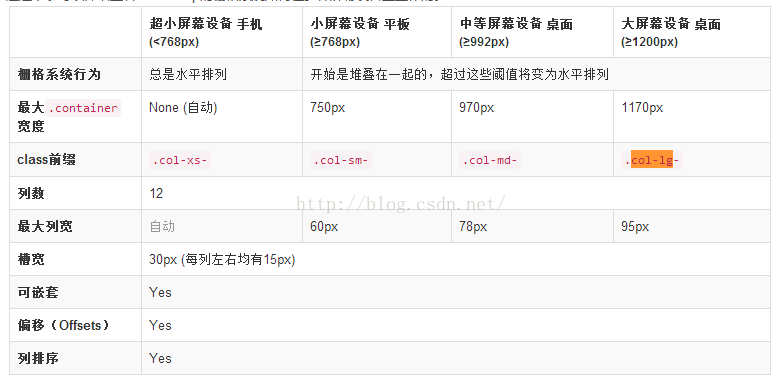

###关于栅格布局
1:使用方法
>栅格布局必须依赖jquery文件  和bootstrap库
```html
 <link href="https://cdn.jsdelivr.net/npm/bootstrap@3.3.7/dist/css/bootstrap.min.css" rel="stylesheet">

    <!-- jQuery (Bootstrap 的所有 JavaScript 插件都依赖 jQuery，所以必须放在前边) -->
    <script src="https://cdn.jsdelivr.net/npm/jquery@1.12.4/dist/jquery.min.js"></script>
    <!-- 加载 Bootstrap 的所有 JavaScript 插件。你也可以根据需要只加载单个插件。 -->
    <script src="https://cdn.jsdelivr.net/npm/bootstrap@3.3.7/dist/js/bootstrap.min.js"></script>
```
2:布局样式
>把每一行分成12列  


3:关于屏幕缩小 元素隐藏
>hidden-md(中等屏幕下隐藏)

4:关于偏移(offset)(margin-left)
>col-sm-offset-4(在小屏幕设备下向右偏移4个单位)

5:关于pull和push(利用定位)
> col-x-push-x 的意思就是往右推多少份
>col-x-pull-x 的意思就是往左拉多少份

